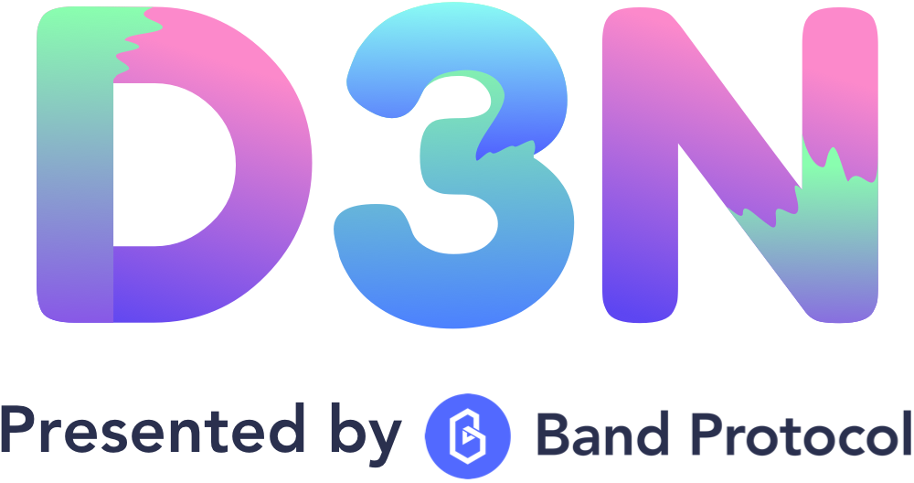

  

# Decentralized Data Delivery Network (D3N)

This repository is a [monorepo] containing the reference implementation of D3N and its various supporting tools. See below for the breakdown and explanation of each module. README for each of the modules.

## Table of Contents

| Module                 | Description                                               |
| ---------------------- | --------------------------------------------------------- |
| [`chain`](chain)       | 🔗 D3N blockchain reference implementation                |
| [`explorer`](explorer) | 🔍 Web interface to explore D3N network                   |
| [`bridges`](bridges)   | 📡 Lite client bridges on other smart contract platforms  |
| [`owasm`](owasm)       | 🔮 WebAssembly library for writing oracle scripts         |
| [`spec`](spec)         | 📖 D3N research and specification knowledge base          |
| [`studio`](studio)     | 🎬 In-browser IDE for testing and deploying owasm scripts |

## Contributing

We highly encourage participation from the community to help with D3N development. If you are interested in developing with D3N or have suggestion for protocol improvement, please open an issue, submit a pull request, or [drop as a line].

[monorepo]: https://en.wikipedia.org/wiki/Monorepo
[drop as a line]: mailto:connect@bandprotocol.com
