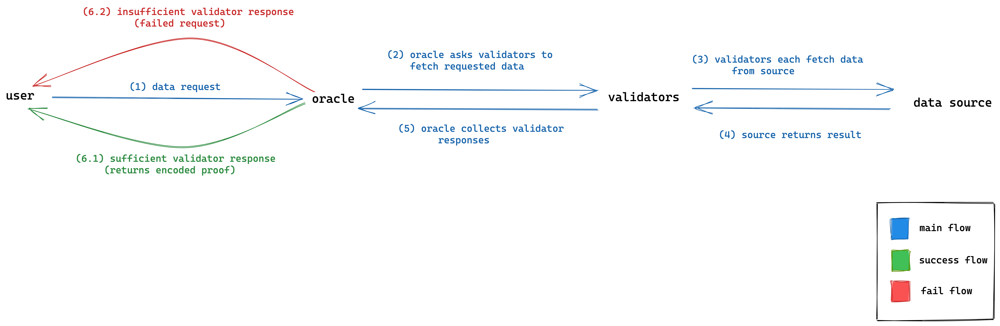

# System Overview

BandChain is a high-performance public blockchain that allows anyone to make a request for off-chain information. It is built on top of the [Cosmos SDK](http://cosmos.network/), and utilizes [Tendermint](https://tendermint.com/)’s [Byzantine Fault Tolerance](https://en.wikipedia.org/wiki/Byzantine_fault) consensus algorithm to reach immediate finality. This finality is specifically reached upon getting confirmations from a sufficient number of block validators.

## Consensus Layer

BandChain’s network consists of a number network participants, each owning BAND tokens. These participants can be broken down into two groups; validators and delegators. In this section, we will mainly focus on the validators, who are responsible for performing two main functions on the network.

First, they are responsible for proposing and committing new blocks in the blockchain. They participate in the block consensus protocol by broadcasting votes which contain cryptographic signatures signed by each validator’s private key. This is similar to most other Cosmos delegated proof-of-stake blockchains.

Each validator will have a certain amount of BAND tokens bonded to them. The source of these tokens can either be their own holdings, or the tokens delegated to them by other token holders. In most cases, there will be a large number of parties with tokens staked to them. In that case, the decisions of who become validators is then determined based on the amount of token staked to each of them. Specifically, the top 100 validator candidates with the most token staked to them will become BandChain’s validators.

The role the validators described above is similar to those of validators on many other Cosmos-based blockchains. In addition, most transactions supported by BandChain (asset transfer, staking, slashing, etc.) are also derived from Cosmos-SDK. What makes BandChain unique, and the origin of the validators' second duty, is the chain’s capability to natively support external data query.

## Oracle Data Request

### Publishing Data Sources and Oracle Scripts

Before any data requests can be made, two conditions must be met:

1. The oracle script that describes the data request must also have been published
2. The data sources related to the aforementioned oracle script must be published to Band’s system

### Data Sources

Data Sources
Data sources are the most fundamental unit of the oracle system. It describes the procedure to retrieve a raw data point from a primary source and the fee associated with one data query. On BandChain, anyone can submit and register a data source into the system.
To publish a data source, one must send a `MsgCreateDataSource` message to the chain. Once deployed a data source is assigned a unique `int64` identifier which can be used to refer to it forever. If the data source owner wants to edit its details once it has been published, they can use that unique identifier as a reference ID.

### Oracle Scripts

An oracle script is an executable program that encodes (1) the set of raw data requests to the sources it needs and (2) the way to aggregate raw data reports into the final result. These sources can be the data sources published on the network, as well as other oracle scripts. This composability makes oracle scripts very similar to [smart contracts](https://en.wikipedia.org/wiki/Smart_contract).

### Oracle Data Request Initialization

A data request to Band's oracle begins when an external party requests data from our oracle by broadcasting `MsgRequestData` *(TODO: LINK TO MSGREQUESTDATA DESCRIPTION)*. The contents of the message includes the oracle script the requester wants to invoke and other query and security parameters.

Once the data transaction is confirmed on BandChain, the requested oracle script will begin its execution, which can be split into two phases. 

### Fetching Data from Specified Data Sources

First, the oracle script’s preparation function will emit the set of raw data requests necessary to continue the oracle script’s execution.The chain’s validators, who are chosen at random for security reasons, will then inspect the raw data requests and execute the associated data sources' procedures as instructed by the request. Each validator that successfully retrieved the data will then submit a raw data report to BandChain, containing the results they got from each of the sources, by broadcasting MsgReportData *(TODO: LINK TO MSGREPORTDATA DESCRIPTION)*. Once a sufficient number of validators, specified in the data request’s security parameters, have reported the raw data results, Once a sufficient number of reports are collected, this will resume BandChain’s execution of the oracle script and begin the script’s second phase of execution.

### Saving the request result onto BandChain

This second phase begins by aggregating all of the validators' reports into a final singular result. This final result is then permanently stored in BandChain’s application state. Once stored, the result becomes available on the BandChain’s state tree and can be sent to other blockchains through Inter-Blockchain Communication *(TODO: LINK TO IBC SECTION)*.

When the final result is successfully stored, an oracle data proof is also produced. This proof is a Merkle proof that shows the existence of the final result of the data request as well as other related information (oracle script hash, the parameters, the time of execution, etc) on BandChain. This proof can then be used by smart contracts on other blockchain to verify the existence of the data as well as to decode and retrieve the result stored. Both of these can be done by interacting with our lite client *(TODO: LINK TO LITE CLIENT SECTION)*.
